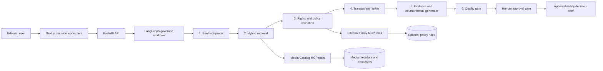

# SignalScope

**SignalScope** is an explainable multimodal media-intelligence copilot for editorial and distribution teams. It turns a natural-language campaign request into an evidence-backed, rights-aware, human-approved recommendation brief.

The repository is designed as a production-style portfolio project rather than a chatbot demo. It demonstrates controlled agent orchestration, hybrid retrieval, MCP-compatible tools, deterministic policy enforcement, transparent ranking, evaluation, and deployment-ready engineering.

> **Demo data notice**  
> The repository contains a synthetic media catalog only. No real ZDF, broadcaster, customer, or copyrighted media assets are included. The project does not automate publication.

---

## Why this project exists

Media teams need more than fluent text generation. A usable AI system must answer:

- Which asset fits the editorial brief?
- Why was it selected?
- Which evidence supports the decision?
- Is the asset rights-cleared for the intended channel?
- Which alternative was excluded, and why?
- Can an editor inspect the workflow before approving a recommendation?

SignalScope addresses this through a **governed workflow**, not an unconstrained agent.

## Core capabilities

| Capability | Implementation |
|---|---|
| **Agentic orchestration** | LangGraph workflow with explicit stages, typed state, conditional routing, and trace events |
| **Hybrid media retrieval** | Metadata, transcript, topics, audience tags, visual descriptions, lexical retrieval, and local vector-style scoring |
| **MCP tool layer** | Read-only Media Catalog and Editorial Policy MCP servers |
| **Explainability** | Factor-level ranking, evidence ledger, transcript timestamps, policy findings, and counterfactual explanations |
| **Safety and governance** | Prompt-injection pre-checks, rights/channel checks, deterministic rules, no automated publishing, human approval gate |
| **Evaluation** | Golden-set runner measuring recall@3, precision@3, evidence coverage, trace success, latency, and guardrail errors |
| **Production engineering** | FastAPI, Pydantic validation, Docker, CI/CD, Terraform, Cloud Run architecture, logging-ready traces |
| **Client-facing UI** | Next.js dashboard for campaign requests, recommendation inspection, policy review, approval, and workflow trace visibility |

---

## Architecture



See [Architecture](docs/ARCHITECTURE.md) for component boundaries and production substitutions.

---

## Workflow design

The workflow uses small, inspectable stages:

1. **Guard request**  
   Detect instruction-like text that attempts to bypass evidence or policy controls.

2. **Interpret brief**  
   Convert the request into a validated task contract with audience, topic, channel, duration, and safety constraints.

3. **Retrieve assets**  
   Perform hybrid retrieval over titles, synopses, transcripts, topics, audience tags, and visual descriptions.

4. **Validate policy**  
   Apply deterministic distribution rights, duration, rating, channel authorization, and content-advisory rules.

5. **Rank assets**  
   Combine relevance, audience fit, channel fit, rights confidence, safety fit, and freshness.

6. **Explain decisions**  
   Produce selected and excluded reasons, timestamp-level evidence, and counterfactual conditions.

7. **Quality gate**  
   Enforce evidence coverage and block unsafe or unsupported results before editorial review.

8. **Human approval**  
   Record an accountable reviewer decision. Publication is intentionally out of scope.

---

## Repository structure

```text
signalscope/
├── apps/
│   └── web/                         # Next.js editorial decision workspace
├── data/
│   └── demo/                        # Synthetic assets, policies, golden evaluation tasks
├── docs/                             # Architecture, security, evaluation, demo, decisions
├── docker/                           # API and frontend Dockerfiles
├── infra/
│   └── terraform/                   # Cloud Run and optional Cloud SQL deployment
├── mcp/
│   └── servers.json                 # Example MCP client configuration
├── scripts/
│   └── run_evaluations.py
├── src/signalscope/
│   ├── agents/                      # LangGraph state and workflow
│   ├── api/                         # FastAPI routes and composition root
│   ├── application/                 # Brief parsing, ranking, explanations, quality gate
│   ├── domain/                      # Typed business models
│   ├── evaluation/                  # Golden-set evaluation runner and metrics
│   ├── infrastructure/              # Catalog, hybrid retrieval, policy, tracing, providers
│   └── mcp/                         # MCP tool servers
├── tests/
└── docker-compose.yml
```

---

## Quick start

### Prerequisites

- Python 3.11+
- Node.js 22+
- Docker Desktop optional

### 1. Configure the backend

```bash
cp .env.example .env
python -m venv .venv
```

macOS or Linux:

```bash
source .venv/bin/activate
```

Windows PowerShell:

```powershell
.venv\Scripts\Activate.ps1
```

Install the backend:

```bash
pip install -e ".[dev]"
```

Start the API:

```bash
make api
```

The API documentation is available at:

```text
http://localhost:8000/api/docs
```

### 2. Start the frontend

```bash
cd apps/web
cp .env.local.example .env.local
npm install
npm run dev
```

Open:

```text
http://localhost:3000
```

### 3. Run evaluation

```bash
make evaluate
```

The command writes a timestamped report to:

```text
artifacts/evaluations/
```

### 4. Run with Docker

```bash
docker compose up --build
```

---

## API examples

Plan a campaign:

```bash
curl -X POST http://localhost:8000/api/v1/campaigns/plan \
  -H "Content-Type: application/json" \
  -d '{
    "request": "Find a short climate awareness video for 18-34 year olds for social media. It must be rights-cleared and evidence-backed.",
    "requested_channels": ["social"],
    "maximum_results": 3
  }'
```

Record an editorial decision:

```bash
curl -X POST http://localhost:8000/api/v1/workflows/<workflow-id>/approval \
  -H "Content-Type: application/json" \
  -d '{
    "reviewer": "Editorial reviewer",
    "decision": "approve",
    "comment": "Approved after rights verification."
  }'
```

Additional examples: [API Examples](docs/API_EXAMPLES.md).

---

## MCP tools

SignalScope exposes two local, read-only MCP servers:

### Media Catalog Server

- `search_assets`
- `get_asset_metadata`
- `get_transcript_segment`

### Editorial Policy Server

- `validate_distribution`
- `check_request_safety`
- `get_editorial_guidance`

Example client configuration is available at [`mcp/servers.json`](mcp/servers.json).

Run the servers:

```bash
signalscope-media-mcp
signalscope-policy-mcp
```

---

## Evaluation and quality gates

The included golden set covers:

- climate and educational-media discovery
- youth-oriented circular-economy content
- explainable-AI editorial recommendations
- rights-safety failures
- family-friendly media library selection

The runner reports:

| Metric | Why it matters |
|---|---|
| Recall@3 | Whether expected assets are retrieved in the top eligible recommendations |
| Precision@3 | Whether top output is focused rather than noisy |
| Evidence coverage | Whether proposed recommendations retain inspectable supporting evidence |
| Valid trace rate | Whether governed stages complete successfully |
| Disallowed recommendation count | Whether policy/risk controls fail open |
| Latency | Whether the workflow is practical for interactive use |

See [Evaluation](docs/EVALUATION.md) for the protocol and extension plan.

A reference local execution is documented in [Reference Results](docs/REFERENCE_RESULTS.md).

---

## Production deployment

The repository includes a GCP-oriented Terraform baseline:

- Cloud Run API service
- Cloud Run frontend service
- Artifact Registry
- Cloud Storage for controlled media and evaluation artifacts
- service account with least-privilege baseline roles
- optional Cloud SQL PostgreSQL instance
- health checks, resource constraints, and scaling bounds

Before deploying, review the `create_cloud_sql` setting and all GCP cost implications.

```bash
cd infra/terraform
cp terraform.tfvars.example terraform.tfvars
terraform init
terraform plan
terraform apply
```

See [Deployment architecture](docs/ARCHITECTURE.md#deployment) for operational notes.

---

## Testing and quality commands

```bash
make test
make lint
make format
make typecheck
make evaluate
```

GitHub Actions runs backend linting, formatting, type checking, tests, evaluation, and frontend build validation on every pull request.

---

## Known limitations and production extensions

The local demo intentionally prioritizes transparency and reproducibility over media-scale performance.

| Current demo implementation | Production replacement |
|---|---|
| Synthetic catalog JSON | Rights-managed CMS, DAM, MAM, or media-archive connector |
| Hashing-vector local retrieval | BGE-M3, multilingual E5, CLIP/SigLIP, or managed vector embeddings |
| In-memory workflow and approval storage | PostgreSQL / Cloud SQL with role-based access controls |
| Rule JSON | Versioned policy service with editorial/legal owner approvals |
| Local trace events | OpenTelemetry collector, Cloud Trace, Langfuse, or enterprise observability backend |
| Deterministic narrative default | Approved API or self-hosted model under an evidence-bound output contract |
| Static visual descriptors | Video keyframes, scene detection, OCR, ASR, and multimodal embeddings |

---

## Portfolio talking points

This project demonstrates that an AI engineer can:

- build an agentic workflow without hiding decisions inside an uncontrolled agent loop;
- connect tools through MCP-ready contracts;
- combine RAG-style retrieval with deterministic safety and editorial rules;
- measure task quality and guardrail behavior rather than relying on a polished UI alone;
- design a complete system from API contracts and dashboard to cloud architecture and CI/CD.

---

## License

MIT. See [LICENSE](LICENSE).
