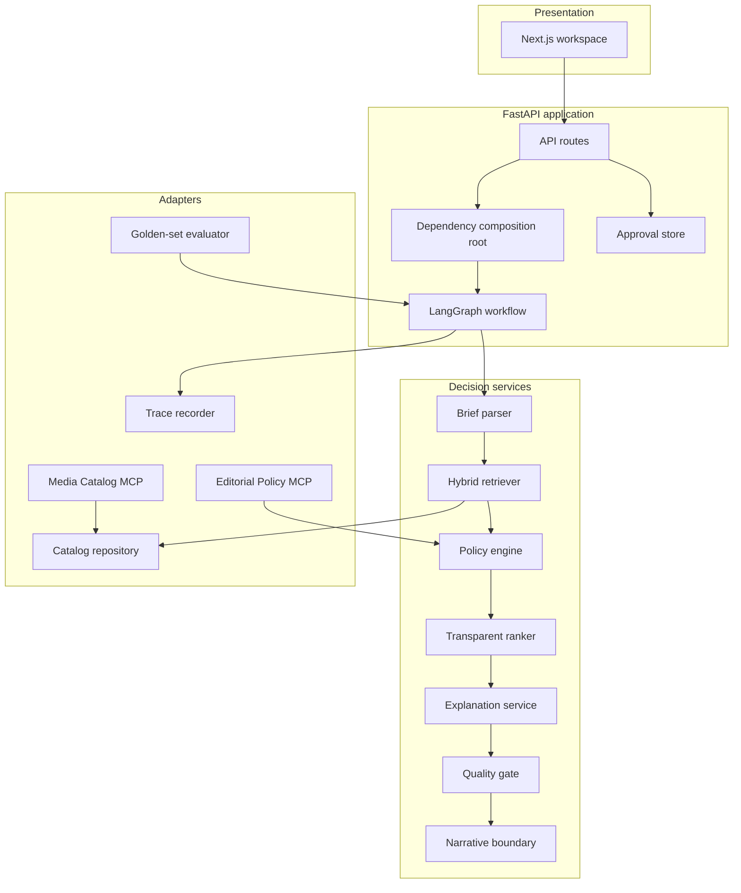
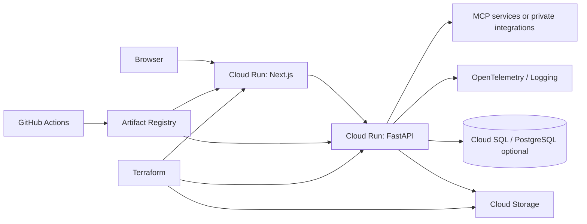

# Architecture

## Design principle

SignalScope treats editorial recommendation as a **decision workflow**, not a free-form answer-generation problem.

The system uses LLM-compatible interfaces where they add value, but rights, policy, and ranking controls remain deterministic and auditable. This makes failures easier to detect, test, explain, and remediate.

## Component boundaries

## Workflow state contract

`MediaWorkflowState` contains the entire explicit execution context:

| State field | Purpose |
|---|---|
| `raw_request` | Original user language retained for audit |
| `brief` | Typed campaign contract used by downstream tools |
| `candidates` | Hybrid-retrieved media candidates |
| `policy_findings_by_asset` | Rules and rights findings separated by asset |
| `ranked_candidates` | Intermediate scoring results before explanations |
| `recommendations` | Decision objects with evidence and counterfactuals |
| `quality_gate` | Whether output can enter human approval |
| `trace_recorder` | Node timing and execution events |
| `decision_brief` | Final approval-ready outcome |

The state is deliberately typed. This reduces hidden side effects and makes unit testing each workflow stage practical.

## Retrieval

### Current local implementation

The demo hybrid retriever combines:

- **lexical scoring** over title, synopsis, transcript, tags, and visual description;
- **stable hashing-vector similarity** for runnable offline development;
- **metadata relevance** for audience, language, channel, and duration;
- **evidence extraction** from the most relevant transcript segments plus catalog metadata.

The result includes lexical, semantic, metadata, and final scores internally. Reviewer-facing output exposes the evidence and decision factors without presenting raw algorithmic internals as authoritative truth.

### Production retrieval path

A production media retrieval layer should separate indices:

1. **Text index**  
   Titles, synopsis, editorial tags, ASR transcripts, OCR, policy documents, and campaign briefs.

2. **Visual index**  
   Keyframes, scene descriptions, visual embeddings, faces or logos only where legally permitted, and object-level metadata.

3. **Structured metadata index**  
   Rights windows, territories, distribution rights, age ratings, languages, publication status, taxonomy, and accessibility metadata.

4. **Policy evidence index**  
   Editorial guidance, legal constraints, channel rules, audience restrictions, and rights documentation.

Recommended implementation choices depend on data governance, scale, language coverage, and infrastructure constraints:

- PostgreSQL plus pgvector for moderate operational complexity;
- Qdrant for a dedicated vector-search service;
- OpenSearch/Elasticsearch for rich hybrid and filtering requirements;
- BGE-M3 or multilingual E5 for text;
- CLIP or SigLIP for image/video keyframes;
- cross-encoder reranking for high-value final ranking.

## Explainability model

SignalScope provides three explanation layers.

### 1. Evidence explanation

Each recommendation has:

- transcript excerpts with start and end timestamps;
- metadata evidence;
- policy findings;
- retrieval score traces.

### 2. Factor explanation

The ranking is decomposed into:

| Factor | Purpose |
|---|---|
| Relevance | Content match to brief topic and language |
| Audience fit | Alignment to target audience tags |
| Channel fit | Authorization and practical format fit |
| Rights confidence | Cleared, restricted, or unresolved rights state |
| Safety fit | Non-blocking policy and sensitivity conditions |
| Freshness | Recency signal useful for editorial relevance |

### 3. Counterfactual explanation

The system states what needs to change for an outcome to change. Examples:

- rights clearance is added;
- a social cut-down is produced;
- the campaign audience changes;
- an editorial content note is attached.

Counterfactuals are valuable because they transform a rejection from an opaque no into an operational next step.

## MCP tool architecture

MCP servers expose read-only, narrowly scoped capabilities.

### Media Catalog MCP

The media server can search assets, return metadata, and return time-bounded transcript segments. It cannot modify asset metadata, create distribution jobs, or publish content.

### Editorial Policy MCP

The policy server can validate a distribution request, check input safety, and return channel guidance. It cannot override rights, change policies, or approve outputs.

### Security properties

- tool permissions are separated by domain;
- tools use typed arguments;
- policy checks are deterministic;
- no tool can trigger publication;
- all workflow stages record a trace event;
- request-safety validation runs before retrieval.

## Deployment

The Terraform baseline configures Cloud Run, Artifact Registry, Cloud Storage, a runtime service account, and optional Cloud SQL. Production environments should additionally use:

- Workload Identity Federation for GitHub Actions;
- Secret Manager for provider keys and service credentials;
- private networking for databases;
- managed identity or service-to-service authentication;
- application-level role-based access control;
- data-retention policies;
- organization-approved monitoring and incident-management tooling.

## Data model

### Asset

An asset includes:

- editorial title and synopsis;
- rights status and channel eligibility;
- content rating;
- topics and audience tags;
- visual summary and keyframe tags;
- transcript segments;
- source URL field;
- publication timestamp.

### Campaign brief

A campaign brief includes:

- raw request;
- goal;
- audience;
- topics;
- requested channels;
- language;
- duration guidance;
- sensitivity indicator.

### Decision brief

The workflow returns:

- executive summary;
- approved recommendation candidates;
- rejected alternatives;
- evidence;
- policy findings;
- counterfactuals;
- quality-gate result;
- full trace;
- human approval record through a separate API endpoint.

## Extension roadmap

1. Replace synthetic catalog with a rights-managed media API or DAM connector.
2. Add ASR, scene segmentation, and keyframe extraction ingestion jobs.
3. Add native multimodal embeddings and cross-encoder reranking.
4. Persist workflows, approval records, and feedback in Cloud SQL.
5. Add authentication, RBAC, audit exports, and tenant isolation.
6. Add prompt-injection benchmark cases and policy regression tests.
7. Add model-policy evaluation for API, self-hosted, and hybrid deployments.
